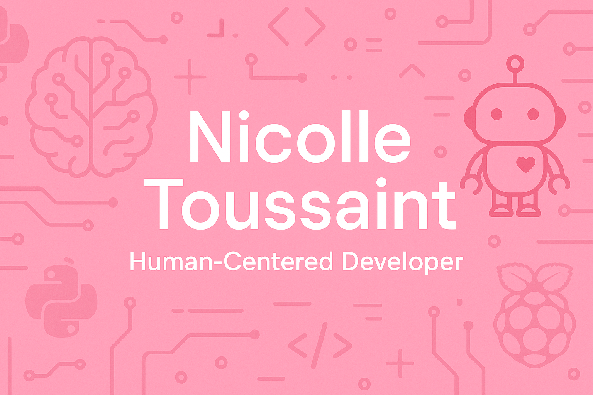

# Hi, I'm Nicolle Toussaint 💻✨

I’m a human centered developer passionate about building emotionally intelligent tech from AI prompts to robotics prototypes that expand accessibility and inclusion.

🔍 What I'm Working On
💻 GitHub Portfolio – Expanding repositories with Python projects, data structures, and automation tools
🧪 Prompt Engineering – Running experiments across GPT and local LLMs to study consistency, context use, and multi model workflows
🏠 Home Lab Projects – Building a personal lab environment for Python automation, LAN experiments, and Raspberry Pi prototypes
🤖 AI Robotics Prototype – LyraBot, a personal AI robotics concept blending movement and emotional support functions

🚀 Skills & Tools
Languages: Python, Java, HTML/CSS, JavaScript (learning React & C)
Hardware: Raspberry Pi, PiDog, Freenove Hexapod
AI & APIs: OpenAI GPT, Hugging Face Spaces, local LLMs, Voice Simulation
Tech Interests: Prompt Engineering, Companion Robotics, Accessibility, Ethical AI

📌 Featured Projects
• GitHub Repos – Python coursework, data structures, and growing AI experiments
• Gratitude Jar App (WIP) – Mobile app for storing and replaying gratitude entries
• Prompt Recipes – Documenting workflows that chain tools, prompts, and outputs

🎯 My Goals
• Earn my degree at Texas Tech University (Human Centered AI / Data Science / Psychology)
• Build a polished prompt engineering and AI development portfolio
• Secure a remote entry level role in prompt engineering, AI research, or inclusive AI development

📬 Let’s Connect

📬 **Let’s Connect**  
[LinkedIn](https://linkedin.com/in/sharron-toussaint-myers-b084a5245) | Nicolle@NeuroElTech.com

